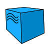
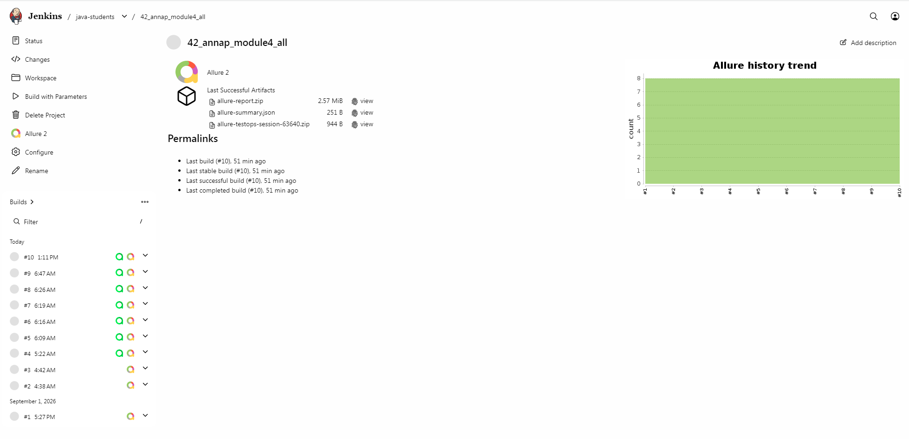
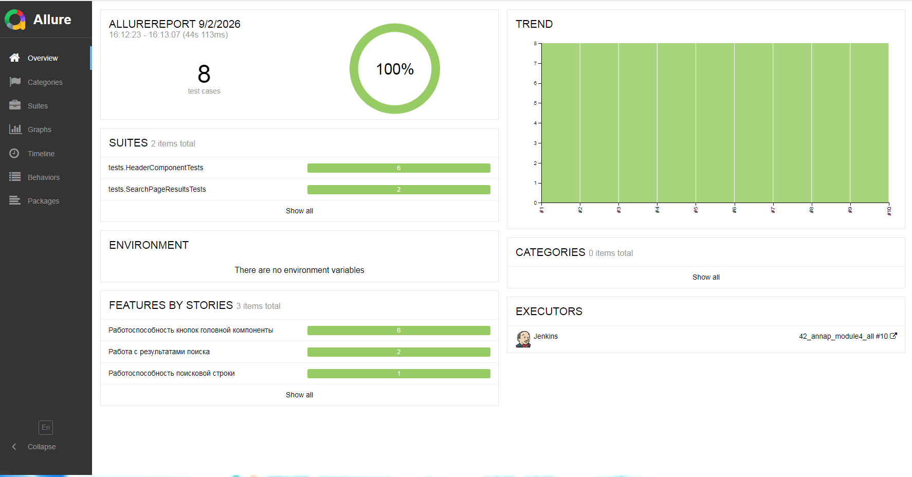
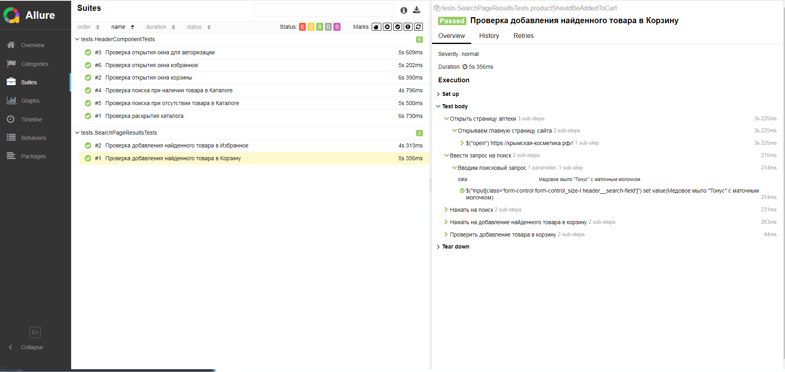
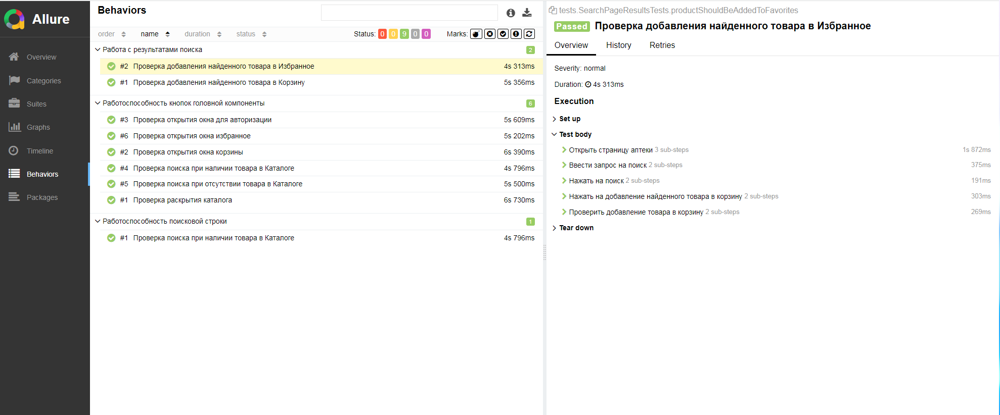
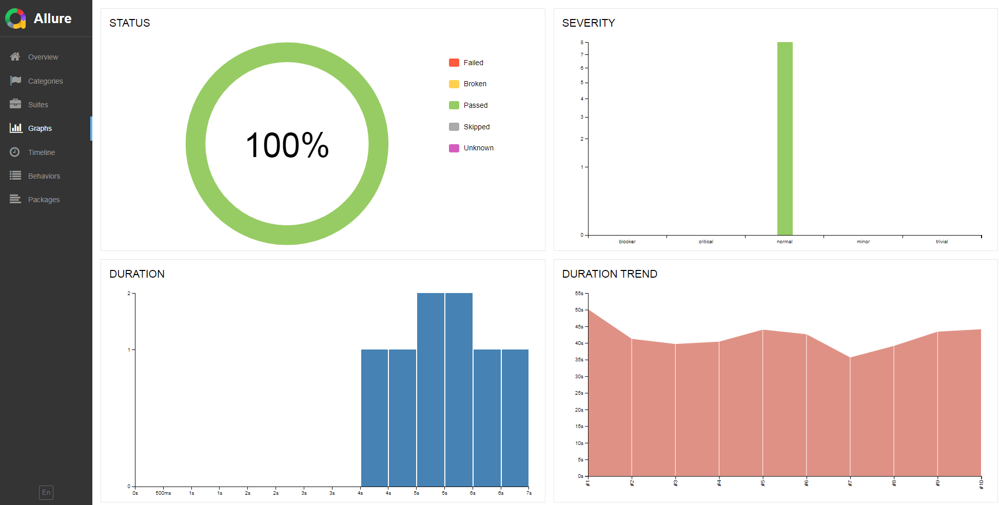
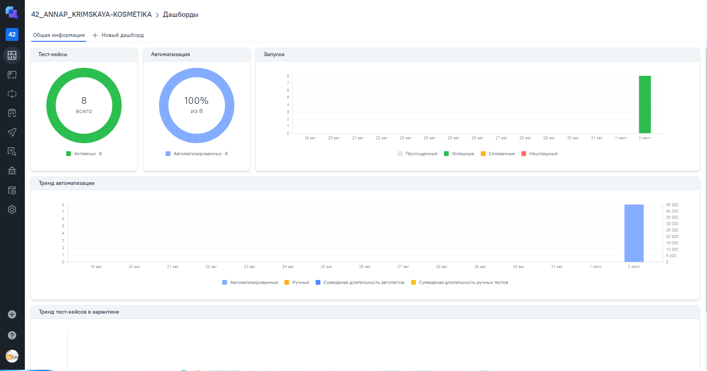
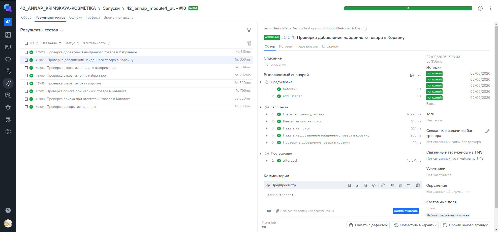

# Демо-проект по автоматизации тестирования для интернет магазина [Крымская-косметика.рф](https://крымская-косметика.рф/)

<p align="center">  
<a href="https://крымская-косметика.рф/"></a>  
</p>

## **Содержание:**

* <a href="#tools">Технологии и инструменты</a>

* <a href="#cases">Примеры автоматизированных тест-кейсов</a>

* <a href="#jenkins">Сборка в Jenkins</a>

* <a href="#console">Запуск из терминала</a>

* <a href="#allure">Пример Allure отчета</a>

* <a href="#allure-testops">Интеграция с Allure TestOps</a>

* <a href="#telegram">Уведомление в Telegram при помощи бота</a>

* <a href="#video">Примеры видео выполнения тестов на Selenoid</a>
____

<a id="tools"></a>
## <a name="Технологии и инструменты">**Технологии и инструменты:**</a>

<p align="center">  
<a href="https://www.jetbrains.com/idea/"></a>  
<a href="https://www.java.com/"></a>  
<a href="https://github.com/"></a>  
<a href="https://junit.org/junit5/"></a>  
<a href="https://gradle.org/"></a>  
<a href="https://selenide.org/"></a>  
<a href="https://aerokube.com/selenoid/"></a>  
<a href="ht[images](images)tps://github.com/allure-framework/allure2"></a> 
<a href="https://qameta.io/"></a>   
<a href="https://www.jenkins.io/"></a>  
<a href="https://www.atlassian.com/ru/software/jira/"></a>  
</p>

- Тесты: IntelliJ IDEA + JUnit5 + Selenide, язык Java
- Сборка: Gradle
- Среда: Selenoid
- Удаленный запуск: Jenkins
- Отчеты: Allure-отчет и отправка результата в Telegram
---

<a id="cases"></a>
## <a name="Примеры автоматизированных тест-кейсов">**Примеры автоматизированных тест-кейсов:**</a>

- ✓ *Проверка работы поиска*
- ✓ *Проверка работы кнопок панели меню*
- ✓ *Проверка работы с найденным с помощью поиска товаром


____
<a id="jenkins"></a>
## </a><a name="Сборка"></a>Сборка в [Jenkins](https://jenkins.qa.guru/view/java-students/job/42_annap_module4_all/)</a>

<p align="center">  
<a href="https://jenkins.qa.guru/view/java-students/job/42_annap_module4_all/"></a>  
</p>


### **Параметры сборки в Jenkins:**

- *browser (браузер, по умолчанию chrome)*
- *browserVersion (версия браузера, по умолчанию 148.0)*
- *browserSize (размер окна браузера, по умолчанию 1920x1080)*
- *baseUrl (адрес тестируемого веб-сайта)*
- *remoteUrl (логин, пароль и адрес удаленного сервера Selenoid)*

<a id="console"></a>
## Команды для запуска из терминала

***Локальный запуск:***
```bash  
gradle clean
```

***Удалённый запуск через Jenkins:***
```bash  
clean
test
--continue
-Durl=$URL
-Dbrowser=$BROWSER
-DbrowserVersion=$BROWSERVERSION
-DbrowserSize=$BROWSERSIZE
-Dheadless=$HEADLESS
-DselenoidUrl=https://user1:1234@$SELENOIDE_URL/wd/hub
```
___
<a id="allure"></a>
## </a> <a name="Allure"></a>Allure [отчет](https://jenkins.qa.guru/view/java-students/job/42_annap_module4_all/allure/)</a>


### *Основная страница отчёта*

<p align="center">  
  
</p>  

### *Тест-кейсы*

<p align="center">  
  
</p>

<p align="center">  
  
</p>

### *Графики*

<p align="center">  
  
</p>

___
<a id="allure-testops"></a>
## </a>Интеграция с <a target="_blank" href="https://allure.qa.guru/project/5372/dashboards">Allure TestOps</a>

### *Allure TestOps Dashboard*

<p align="center">  
  
</p>  


### *Авто тест-кейсы*

<p align="center">  
  
</p>

____
<a id="telegram"></a>
## </a> Уведомление в Telegram при помощи бота

<p align="center">  
  
</p>

____
<a id="video"></a>
## </a> Примеры видео выполнения тестов на Selenoid

Каждый тест дополняется вложениями:
- Видео
- Ресурс страницы
- Последний скриншот
- Логи страницы

<p align="center">
   
</p>

